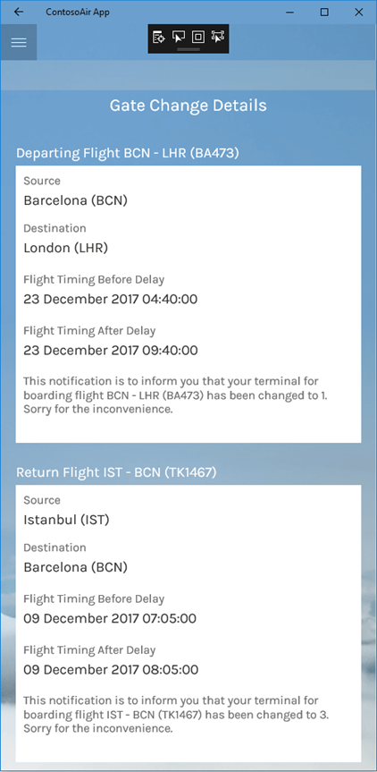
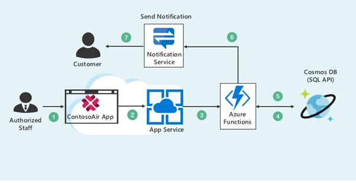

# Gate change notification to the user for specific flight using Azure Cosmos DB with Notification service 

## User Story

Consider the user scenario, Kevin wants to travel from Seattle to Barcelona. But due to gate change of one of connecting flight, he struggled to move from one gate to another. So, in this experience we will provide, gate change notification to the end user for his convenience using **Contoso Air App** with **Cosmos DB**, **Azure functions** and **Notification Service**.

 

## Components Used in Scenario

 

- **Azure Cosmos DB** is Microsoft's globally distributed, multi-model database. With the click of a button, Azure Cosmos DB enables you to elastically and independently scale throughput and storage across any number of Azure's geographic regions. It offers throughput, latency, availability, and consistency guarantees with comprehensive (SLAs), something no other database service can offer. ([Azure Cosmos DB](https://docs.microsoft.com/en-us/azure/cosmos-db/))
- **Notification Hubs** / **Azure Notification APIs** , a multi-platform, scalable push-notification engine for quickly sending millions of messages. ([Notification API](https://docs.microsoft.com/en-us/azure/notification-hubs/notification-hubs-push-notification-overview))
- **Azure Functions** is a serverless compute service that enables you to run code on-demand without having to explicitly provision or manage infrastructure. Use Azure Functions to run a script or piece of code in response to a variety of events. ([Azure Functions](https://docs.microsoft.com/en-us/azure/azure-functions/))

## What you will learn from this experience

- Creating collections/insert data in **Cosmos DB** using **Data Migration Tool**.
- Creating **Azure Functions** to retrieve delayed flight details.
- Playing around code in **Visual Studio 2017** IDE to retreive delayed flight details in ContosoAir app.
- Configuration of **Notification API.**
- Playing around code in **Visual Studio 2017** IDE to receive notifications for delayed flights in ContosoAir app.
- Playing with **ContosoAir Application** to book tickets and get timely notifications.

>  **Ready? Let's get started!**