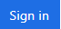
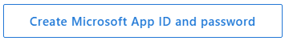
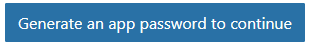
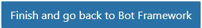
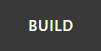

<page title="Creating Azure Bot"/>

## Scenario 1 -  Creating Azure Bot

   > _We'll start with accessing **Azure Portal.** For creating resources, you need to **Sign in** to **Azure Portal.** The steps to do the same is given below:_

1. Click on the [Login to Azure](launch://launch_azure_portal) link to open **Azure Portal** and maximize the browser window.
1. Sign in with your Azure **Username** and **Password**
    - Username: **<inject key="AzureAdUserEmail" />**
    - Password: **<inject key="AzureAdUserPassword" />**
1. Click on **Sign in** button. 

1. If you see the **Stay signed in?** screen next, select the **Yes** button to continue.
1. You may encounter a popup entitled **Welcome to Microsoft Azure** with options to **Start Tour** and **Maybe Later** –Choose **Maybe Later**. [Ignore the **Step 5** if didn't get the popup message]
   > _Great! You are now login into the Azure Portal. Next, we will see how to create Azure Bot Service._
5. Click on the **Resource groups** option present under icon  and select **<inject story-id="story://Content-Private/content/dfd/SP-GDA/gdaexpericence7/story_a_azurebotservice_with_cosmosdb" key="myResourceGroupName"/>** resource group present under **Resource groups blade**.
1. Now click on **<inject story-id="story://Content-Private/content/dfd/SP-GDA/gdaexpericence7/story_a_azurebotservice_with_cosmosdb" key="contosoAirBot"/>** present in right side panel with **Type** as **App Service**.
1. Select **C#** from **Choose a template** option then click on **Basic** template and click on **Next** button at the bottom of the page.
1. Click on **Create Microsoft App ID and password** button. 
   It will redirect you to another tab for generating **App ID** and **Password**.
1. In the **Email** field, enter **<inject key="AzureAdUserEmail" />** 
1. In the **Password** field, enter **<inject key="AzureAdUserPassword" />**
1. Click on **Sign in** button to register the bot on **Application Registration Portal**.
1. Create a **Notepad** file **Credential.txt** on desktop, copy & paste the **App ID** into it and save the file.
   > **NOTE:** While copying the credentials in **Credentail.txt** file, Make sure that they are **labeled** properly for further inconvenience.
   ```txt
   App ID :
   Password :
   URI :
   PRIMARY KEY :
   PRIMARY CONNECTION STRING :
   APIEndpointURL : 
   ```                 
1. Now again come back to the browser and click on 
   button to generate the **App Password**. It will generate the pop-up window containing **App password**.
1. Copy generated password into the **Credential.txt** file against **Password** and save the file.
1. Again, come back on the browser and click on **Ok** button to close the **New password generated** popup window.
1. Click on 
   button.
1. Now, paste the **App Password** copied from **Step 14** into field **Paste password from the Microsoft App registration portal**.
1. Select both the checkboxes 
   to accept **Terms** and **Privacy Conditions**.
1. Finally click on **Create bot** button to deploy the Bot on Azure.
   >**NOTE:** Please wait, it takes some time to complete the Bot deployment process.
1. After successful completion of the deployment process you will be redirected to the **BUILD** tab 
1. Click on **Download zip file** button present under **Download source code** section to download the source code for the created Bot.
1. It will generate the pop-up prompting to save the downloaded source code, click on **Save** button.
   > _Nice work! You have successfully created Bot._