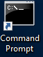
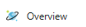
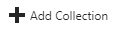
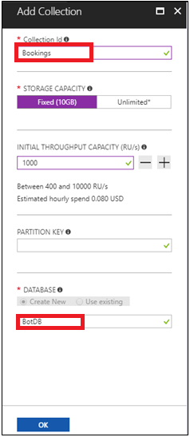
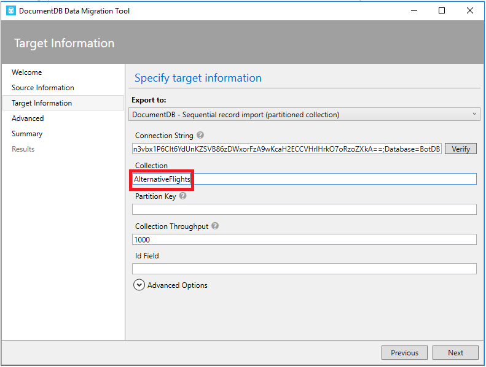
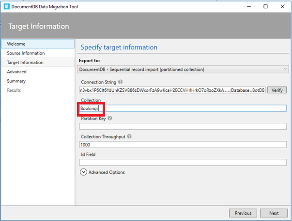
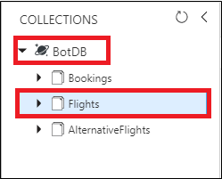
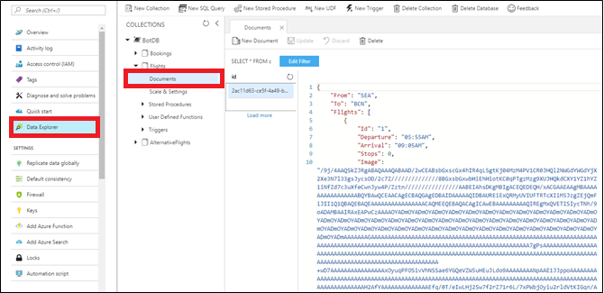

<page title="Creating Cosmos DB collection"/>

## Scenario 2 - Creating Cosmos DB collection

### Part A - Adding collection in Cosmos DB

   > _Let's create database into Cosmos DB(SQL) with Bookings as a collection._

1. Open the command prompt window by clicking on  icon present on the desktop.
1. Type below commands to clone the Application Source Code into folder **c:\source\experience5**    
    ```cmd
    git clone https://github.com/Click2Cloud/gdaexperience5-story-a c:\source\experience5
    ```
1. Switch to **Azure Portal** as launched in **Scenario 1**.
1. Click on the **Resource groups** option present under 
   icon and select **<inject story-id="story://Content-Private/content/dfd/SP-GDA/gdaexpericence7/story_a_azurebotservice_with_cosmosdb" key="myResourceGroupName"/>** resource group present under **Resource groups blade**.
1. Now click on Cosmos DB account **<inject story-id="story://Content-Private/content/dfd/SP-GDA/gdaexpericence7/story_a_azurebotservice_with_cosmosdb" key="documentDBAccountName"/>** present in right side panel with **Type** as **Azure Cosmos DB account** and click on **Overview** option. 
1. Click on  option present on the menu bar.
1. Enter **BotDB** in the **DATABASE** field, **Bookings** as a **Collection Id**.
1. Select the **Storage Capacity** as **Fixed** and finally click on **OK** button.
    
    > _Here you have created a collection Booking under Cosmos DB._

### Part B - Inserting data in Cosmos DB using Data Migration Tool

   > _But, what you will do with Cosmos DB without data? So, let's insert some data into Cosmos DB using Microsoft's Data Migration Tool._

   > **NOTE:** In this experience, we have used the **Data Migration Tool**. To know more about the migration tool, click on the given link: [Data Migration tool.](https://docs.microsoft.com/en-us/azure/cosmos-db/import-data)

1. Launch the **Data Migration Tool** by double clicking on **dtui.exe**
   file present on **Desktop**.
1. After the tool is launched, click on **Source Information** menu present on the left panel.
1. Select **JSON file(s)** option from **Import from** dropdown.
1. Click on **Add Files** button.
1. Select first JSON file named **Flights.json** present at location **"C:\source\experience5\CosmosDBCollections"** and click on **Open** button.

   > **NOTE:** The folder **C:\source\experience5\CosmosDBCollections** contains three different JSON files, please select one file at a time and complete the procedure for each file one by one to create the three different collection on Azure Cosmos DB.
1. Then click **Next** button to redirect to **Target information** menu.
1. Now switch to **Azure Portal** as launched in **Scenario 1**.
1. Go to Azure Portal's **Resource groups** option present in the favourites menu on the left side panel and select your created resource **<inject story-id="story://Content-Private/content/dfd/SP-GDA/gdaexpericence7/story_a_azurebotservice_with_cosmosdb" key="myResourceGroupName"/>** and click on **<inject story-id="story://Content-Private/content/dfd/SP-GDA/gdaexpericence7/story_a_azurebotservice_with_cosmosdb" key="documentDBAccountName"/>** option of Type **Azure Cosmos DB account.**
1. Click on **Keys** option present under **Azure Cosmos DB account** blade in the left panel and copy the **URI**, **PRIMARY KEY** and **PRIMARY CONNECTION STRING** values and paste it into the **Credential.txt** file present on **Desktop** and save the file.
   
1. Now copy the **PRIMARY CONNECTION STRING** from the **Credential.txt** file present on **Desktop**.
1. In case, you get a pop-up window, click on **Allow access** button. 
1. Switch back to **Data Migration Tool** already launched in **Step 1** of **Part B**.
1. Paste the copied **PRIMARY CONNECTION STRING** in **Connection String** text box and appended it with the **Database Name** at the end of the string in target information option.
   
   >**NOTE:**
   >- In our case, Cosmos DB Account Name is **BotDB** so, append the string **Database=BotDB** after the copied **PRIMARY CONNECTION STRING**.
   >- For example :- AccountEndpoint=https://botdb.documents.azure.com:443/;AccountKey=AccountEndpoint=https://contosoairdocdbXXXX.documents.azure.com:443/;AccountKey=XXXXX;Database=BotDB
1. Copy the same appended **Connection String** in the **Credential.txt** file present on the **Desktop** and save the file.

   
1. Enter the collection name same as the name of JSON file provided in **Specify source information step** of wizard.
   > For example, if you have selected **Flights.json** file then the collection name should be **Flights**, for  **Bookings.json** it should be **Bookings** and for **AlternativeFlights.json** it should be **AlternativeFlights**.
1. Now click on **Verify** button next to **Connection String** field to verify the connection string.
1. On successful verification of Connection string, success pop-up window will display, then click on **OK** button.
   
1. On verification failure of connection string, a pop-up window will appear prompting the failure message, then click on **OK** button and again verify the connection string till successful verification.
1. Click on **Next->Next->Import** to import the data present in JSON file into Cosmos DB collection.
1. This will start the data uploading process. Wait for some time to complete the process and once the process is completed successfully close the Migration Tool.
1. Repeat the above steps to import other two files **AlternativeFlights.json** and **Bookings.json** present at the location **"C:\source\experience5\CosmosDBCollections"** into **Cosmos DB**.
   
   
1. Now, switch to **Azure Portal** in which you are already logged in from **Scenario 1.**
1. Click on Azure Portal's **Resource groups** option present in the favourites blade in the left side panel and click on **<inject story-id="story://Content-Private/content/dfd/SP-GDA/gdaexpericence7/story_a_azurebotservice_with_cosmosdb" key="myResourceGroupName"/>**.
1. Click on **<inject story-id="story://Content-Private/content/dfd/SP-GDA/gdaexpericence7/story_a_azurebotservice_with_cosmosdb" key="documentDBAccountName"/>** which is your **Cosmos DB Account.** Then click on **Data Explorer** option present under **Azure Cosmos DB account** blade to view the imported collections.
1. Then click on created collection **"Flights"** to expand. Click on **Documents** option under the **COLLECTIONS** to view the data imported through **Migration Tool** into **Cosmos DB.**
   
   
   > _Excellent!! You have successfully created collection and inserted data in your Cosmos DB using Data Migration Tool._