<page title="Playing around the Visual Studio code"/>

## Scenario 3 – Playing around the Visual Studio code

### Part A - Importing the projects into Visual Studio 2017 IDE and publishing the code

   > _In this part, you will learn how to import the existing Bot code into **Visual Studio 2017** IDE and run it locally using **Bot Framework Emulator**._

1. Open the **File Explorer** and go to **Downloads** folder. **Right click** on the file which is downloaded in **Scenario 1** and click on **Extract All** option.
1. Now click on **Extract** button.
1. Navigate to the extracted folder and **double click** on **"Microsoft.Bot.Sample.SimpleEchoBot.sln"** file to load the project into **Visual Studio 2017** IDE.
1. Select **Visual Studio 2017** and click on **OK** button to open the solution file in Visual Studio.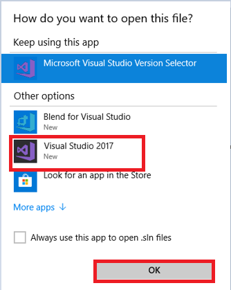
1. If prompted to sign in to **Visual Studio**, click **Sign in**
1. In the **Email or phone** field, type **<inject key="AzureAdUserEmail"/>**
1. In the **Password** field, type **<inject key="AzureAdUserPassword"/>**
1. Click **Sign in**
1. If prompted with the Choose your **color theme screen**, select a color theme
1. Click on **Start Visual Studio**
1. If you see the pop-up window for security warning, click on **Ok** button. 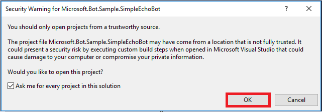
1. Right click on the project **"Microsoft.Bot.Sample.SimpleEchoBot"** and click on **Set as StartUp Project.**
1. Now select **Debug** option 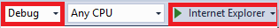
   from **Solution Configurations** menu, select **Internet Explorer** option from dropdown and click on **Internet Explorer** button to run the project.
1. It will launch the **SimpleEchoBot** in browser, copy the **URL** from the browser and paste it into the **botframework-emulator** present on the **Desktop** by double clicking on the botframework-emulator icon 
   and append **/api/messages** text in the **URL**, click on **Connect** 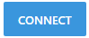 button.

   > **For Ex:**
   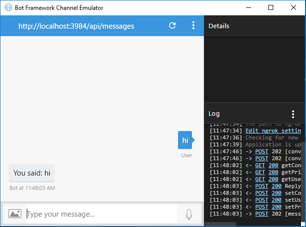
1. Opening **botframework-emulator** generates the pop-up message showing firewall is blocked, click on **Cancel** button.

1. Go to the **Visual Studio 2017** IDE and click on 
   button to **Stop Debugging**.
1. Now right click on the  **Solution Window->Add** and then click on **Existing Project**. Select the file type as **Solution Files**(*.sln) and select **"ContosoAir.Services.sln"** from the directory **"C:\source\experience5\ContosoAir"** and click on **Open** button.
   
1. Again, right click on the  **Solution Window->Add** and click on **Existing Project**. Select the file type as **Solution Files** (*.sln) and select **"ContosoAir.Xamarin.sln"** from the directory **"C:\source\experience5\ContosoAir"** and click on **Open** button.
   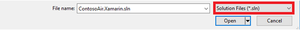
1. Double Click on **config.js** file from **"ContosoAir.Services"** project to open the file in the code editor window.
1. Replace the values for parameters **DOCUMENT_DB_ENDPOINT**, **DOCUMENT_DB_PRIMARYKEY** with **URL** and **PRIMARY KEY** present in **Credential.txt** file present on the **Desktop** and save the file.
   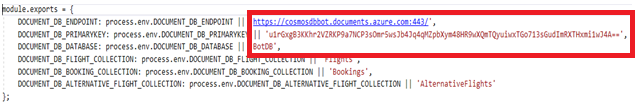
1. Right click on project **"ContosoAir.Services"**, click on **Open Command Prompt Here** option. It will open the command prompt screen. Type command **npm install** and press enter button to install all the dependencies.
1. Right click on the project **"ContosoAir.Services"** and click on **Set as StartUp Project.**
1. Select the **Release** option and click on **Internet Explorer** to run the **"ContosoAir.Service"**
   project in the release mode.
   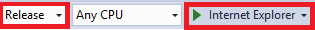
1. Clicking on **Internet Explorer** button it shows pop-up of firewall, downloads window, clilck on **Cancel** button for both the pop-up windows.
   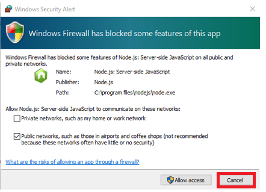 
   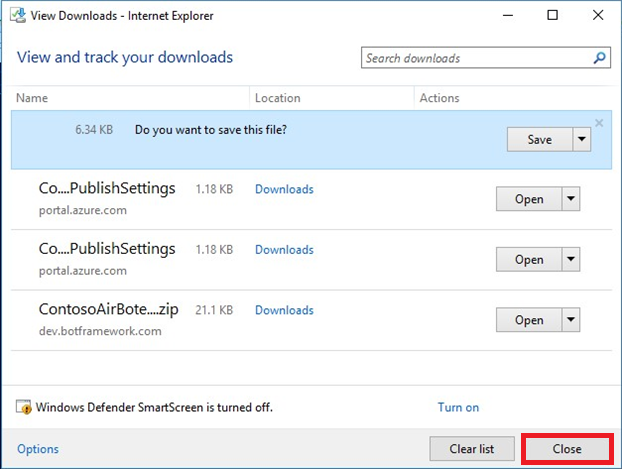
   >**NOTE:**
   Here it deploys the services on localhost. It will redirect you to browser, please ignore this step.
1. After successful completion click on **Stop debugging**  button.
1. Switch to **Azure Portal** as launched in **Scenario 1**.
1. Click on the **Resource groups** option present under  icon and click on the Resource group **<inject story-id="story://Content-Private/content/dfd/SP-GDA/gdaexpericence7/story_a_azurebotservice_with_cosmosdb" key="myResourceGroupName"/>** under **Resource groups blade**.
1. Now click on the **<inject story-id="story://Content-Private/content/dfd/SP-GDA/gdaexpericence7/story_a_azurebotservice_with_cosmosdb" key="webApiEndpoint"/>** webapp option present in the right-side panel with **Type** as **App Service.**
1. Click on 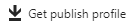 option present on Menu bar. It will **download** one file, click on **Save** button appearing in the pop-up message to save the file.
1. Now go to **Visual Studio 2017** IDE and right click on the project **"ContosoAir.Services"** from
   the **Solution Explorer** window and click on **Publish** option.
1. Click on the **Import** option present under **Profile** Tab. Click on the **Browse** button and select
   the downloaded file having extension **.PublishSettings** from **Downloads** section and click on **Open->OK** button.
   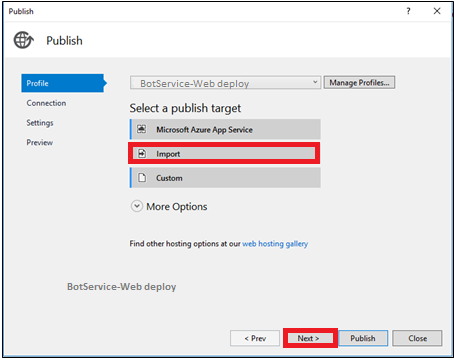
   >**NOTE:** Wait for some time unless the below screen appears.
   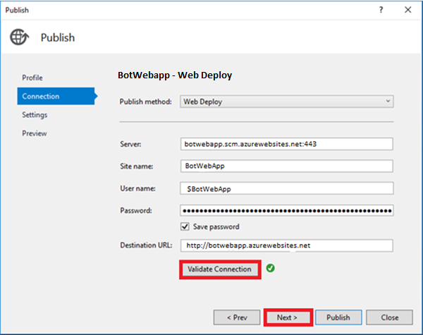
1. Click on 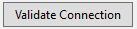 button to validate the connection then click on **Next->Next->Publish** button. Wait till the publish process completes.
1. If you get a pop-up window click on **Close** button.
   

1. After successful publish, copy the **API Endpoint URL** from **Visual Studio 2017** IDE as shown below and paste it into **Credential.txt** file present on **Desktop**.

   

### Part B - Modifying the code & Adding selection option in the Bot

   > _Now let's try to add some option in the Bot by your own._

1. Now go to the **Visual Studio 2017** IDE, right click on project **"Microsoft.Bot.Sample.SimpleEchoBot"**, select **Add->New Folder** and create two folders at the root level of project with following names.
   -  Forms
   -  Models
1. Right click on the **Dialogs** folder and click on the **Add** button. Select **Existing Item**.
1. Go to the **C:\source\experience5\BotCode\Dialogs** under **This PC** section, select all the file and click on **Add button**. It will show one pop-up window click on **Yes** button.

   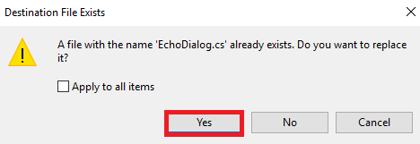

1. Right click on the **Forms** folder and click on **Add** button. Select **Existing Item**.
1. Go to the **"C:\source\experience5\BotCode\Forms"** under **This PC** section, select all the files and click on **Add** button.
1. Right click on the **Model** folder and click on **Add** button. Select **Existing Item**.
1. Go to location **"C:\source\experience5\BotCode\Models"** under **This PC** section, select all the files and click on **Add** button.
1. Now right click on the Project **"Microsoft.Bot.Sample.SimpleEchoBot"** and select **Add** button, click on **Existing Item** and browse **Locale.cs** and **Constants.cs** files from the **"C:\source\experience5\BotCode"** under **This PC** and click on **Add** button.
1. Add **using  SimpleEchoBot.Dialogs;**  namespace in the **MessagesController.cs** file present under **Controller** folder and save the file.
    ```cs
    using SimpleEchoBot.Dialogs;
    ```
1. Now go to the project **"Microsoft.Bot.Sample.SimpleEchoBot"** and double click on **Global.asax** file add the following namespaces in the namespace section to use the functions witin these classes.

   ```C#
   using Autofac;
   using System.Configuration;
   using Microsoft.Bot.Connector;
   using Microsoft.Bot.Builder.Azure;
   using Microsoft.Bot.Builder.Dialogs;
   using Microsoft.Bot.Builder.Dialogs.Internals;
   using Microsoft.Bot.Builder.Internals.Fibers;
   ```
1. Add below code in the **Application_Start()** function block in **Global.asax** file above line GlobalConfiguration.Configure(WebApiConfig.Register);

    ```c#
    var uri = new Uri(ConfigurationManager.AppSettings["DocumentDbUrl"]);
    var key = ConfigurationManager.AppSettings["DocumentDbKey"];
    var store = new DocumentDbBotDataStore(uri, key);
  
    Conversation.UpdateContainer(
    builder =>
    {
    builder.Register(c => store)
    .Keyed<IBotDataStore<BotData>>(AzureModule.Key_DataStore)
    .AsSelf()
    .SingleInstance();

    builder.Register(c => new CachingBotDataStore(store, CachingBotDataStoreConsistencyPolicy.ETagBasedConsistency))
    .As<IBotDataStore<BotData>>()
    .AsSelf()
    .InstancePerLifetimeScope();
    builder.RegisterModule(new ReflectionSurrogateModule());

    });
    ```

    > The above code is used to store and manage bot's state data into Azure Cosmos DB.

1. Right click on **Microsoft.Bot.Sample.SimpleEchoBot** solution and click on **Manage NuGet Packages for Solution** option.
1. It will open one new window, click on **Browse** tab and type **Microsoft.Bot.Builder.Azure** in the provided search box, select Microsoft.Bot.Builder.Azure option.
   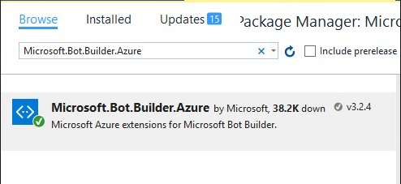 
1. Click on **Install** button.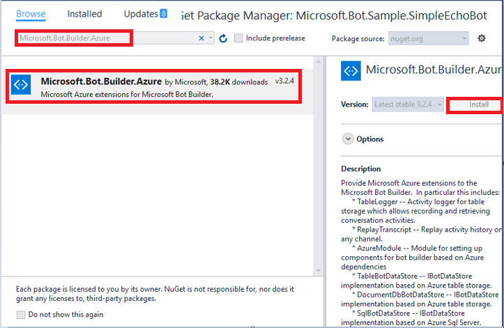
1. Click on **OK** button.
   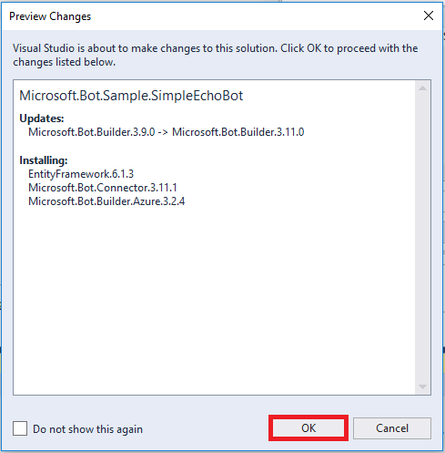
1. Click on **I Accept** button.
   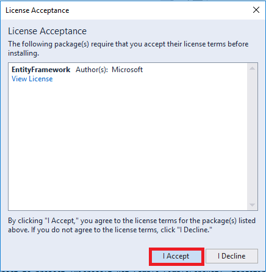
   >**NOTE:**
   > - Please wait, it takes some time to install all the dependencies.
   > - Click on **Yes to All** option appearing throughout the installation steps.

1. Copy below three lines of code under the **appSettings** tag in **Web.config** file, replace the **URI**, **PRIMARY KEY**, **API Endopoint** with the values present in **Credential.txt** file present on the **Desktop**. Make sure that **/api/bot** text is appended after the **API Endpoint**.

    ```xml
    <add key="DocumentDbUrl" value="URI"/>
    <add key="DocumentDbKey" value="Primary Key"/>
    <add key="APIEndpint" value="API Endpoint"/>
   ```
1. Right click on the project **"Microsoft.Bot.Sample.SimpleEchoBot"** and click on **Set as StartUp Project** then select **Debug** option and click on **Internet Explorer** button to run the application.
   
   > **NOTE:**
   > It will take some time to run the application. It will redirects to the browser.
1. Copy the **URL** from browser, append text **/api/messages** and paste in the **botframework-emulator**  present on **Desktop** and click on Connect  button.   
   > **NOTE:** Now add your own options into Bot and see some changes. Here you will see that there are 3 options in the Bot already.
   >**NOTE:**
   > Enter PNR code as contoso123
1. Now go to **Visual Studio 2017** IDE and click on **Stop Debugging** button.
1. Adding another option in the available list of file **EchoDialog.cs** **"Microsoft.Bot.Sample.SimpleEchoBot/Dialogs"** present under project
1. Right click on the **Model** folder and click on **Add** button. Select **Existing Item**.
   - Go to **"C:\source\experience5\BotCode\ForOption 4"** under **This PC** section, select all the files and click on **Add** button to add the code for option 4 in the **Bot**.
1. Add below code at Line number 40 in **EchoDialog.cs** file to add **4th option** in the Bot.
    ```C#
    MenuOption.Options.Add(new Options(4, "Flight Status"));
    ```
1. Add below code at line number 82 in **EchoDialog.cs** file.
   >**NOTE:** The CheckFlightStatus function is used to display Flight status of **PNR** code given by the user. As soon as user enters the **PNR** code and presses enter button the **CheckFlightStatus** function gets call.
   > In this function, we are calling Service API to get the flight status according to **PNR** code given by the user. The Service API result will be stored in **FlightStatus** model and we are accessing **FlightStatus** data and append it to the **StringBuilder** object which will be appear on screen using await **context.PostAsync()** method . In await **context.PostAsync()**, we are passing **StringBuilder** object as a parameter.
   >**NOTE:**
   > Add the below line of code at line number 82.
    ```C#
    else if (number == 4)
    context.Wait(CheckFlightStatus);
    ```
   >**NOTE:**
   > Add the below line of code at line number 85.
    ```c#
    public async Task CheckFlightStatus(IDialogContext context, IAwaitable<IMessageActivity> result)
    {
    var res = await result;
    var PNRCode = res.Text;
    var message = context.MakeMessage();
    if (res.Text != "")
    {
    try
    {
    IEnumerable<FlightStatus> flightstatusdata = null;
    FlightStatus flightstatus = null;
    using (var httpClient = new HttpClient())
    {
    var response = await httpClient.GetAsync(ConfigurationManager.AppSettings[Constants.KeyApi] + "/flightstatus/" + PNRCode);
    object DeserializeResult = JsonConvert.DeserializeObject(await response.Content.ReadAsStringAsync());
    flightstatusdata = JsonConvert.DeserializeObject<IEnumerable<FlightStatus>>(DeserializeResult.ToString());
    }
    foreach (FlightStatus flttatus in flightstatusdata)
    {
    flightstatus = flttatus;
    }
    if (flightstatus != null)
    {
    var sb = new StringBuilder();
    sb.AppendLine(" Flight No : " + flightstatus.Flight);
    sb.AppendLine(Constants.EmptyLine);
    sb.AppendLine(" Departure Time : " + flightstatus.departTime);
    sb.AppendLine(Constants.EmptyLine);
    sb.AppendLine(" Terminal No : " + flightstatus.FromTerminalNo);
    sb.AppendLine(Constants.EmptyLine);
    sb.AppendLine(" Gate No : " + flightstatus.FromGateNo);
    sb.AppendLine(Constants.EmptyLine);

    await context.PostAsync(sb.ToString());
    context.Wait(OnComplete);
    }
    else
    {
    await context.PostAsync(Locale.FlightNotFound);
    context.Wait(OnComplete);
    }
    }
    catch (Exception ex)
    {
    await context.PostAsync($"Failed with message: {ex.Message}");
    }
    }
    }

    ```
1. Select the **Release** option from **Solution Configurations** menu and click on **Internet Explorer** button. 
1. Click on **Continue Debugging** button.
   
   > **NOTE:**
   It will take some time to run the application. After successful completion of the process it will redirect to browser.
  
1. Copy the **URL**, append text **/api/messages** and paste it in the **botframework-emulator**  present on the **Desktop** and click on **Connect**  button.
1. Here you will see that the **fourth** option is present in the Bot.
1. Go to **Visual Studio 2017** IDE and click on **Stop Debugging** button.
1. Now go to **Visual Studio 2017** IDE and right click on the project **"Microsoft.Bot.Sample.SimpleEchoBot"** from the **Solution Explorer** window and click on **Publish** option.
1. Click on Create new profile option. 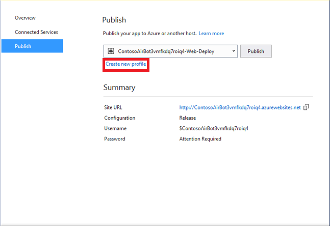
1. Select **Import profile** option and click on **Ok** button. 
1. Go to the path **"C:\Users\LabUser\Downloads\ <inject story-id="story://Content-Private/content/dfd/SP-GDA/gdaexpericence7/story_a_azurebotservice_with_cosmosdb" key="contosoAirBot"/>\PostDeployScripts"** and select the file having extension .PublishSettings and select **Open** button and then **Publish** option.
   > _Awesome, here you have successfully added options by your own for the skype bot._

1. Expand App folder from **Solution** expand **"ContosoAir.Clients.Core"** and click on **GlobalSettings.cs** file.
1. Copy **APP ID** from the **Credential.txt** file present on the **Desktop** and past it at line number 11 after the text **28:** 
   >**For EX:**
   public const string SkypeBotAccount = "28:XXXXXXXXXX";
1. Now go to **"ContosoAir.Clients.UWP"** and right click on it, click on **Set as StartUp Project**.
1. Click on **Local Machine** Button. 
   It will take some time to build the application and after successful completion of building process it will launch **ContosoAir UWP** app.
   > **NOTE:** You should have *Microsoft**Account *Credentials* to Login and get access to *ContosoAir** application.
   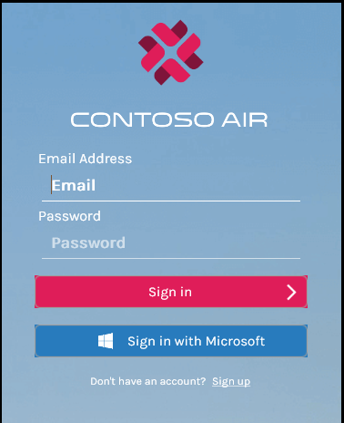
1. Enter your **Email Id** and **Password** in the provided field and click on **Sign in** button.
1. Click on the **Hamburger** icon. To go to the **Contacts** option.
   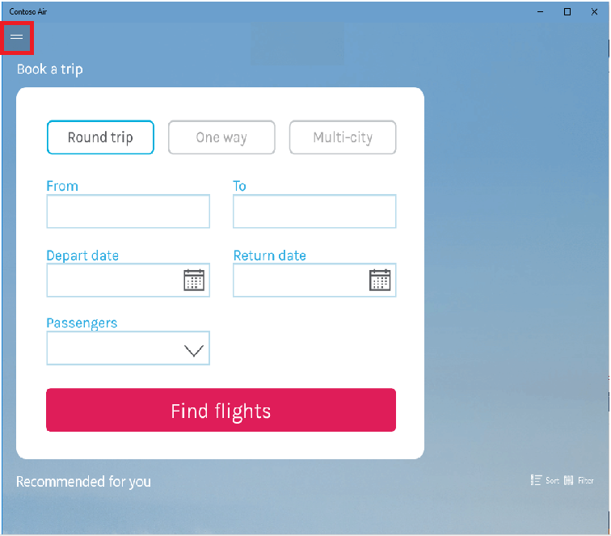
1. Click on **Contacts** option.
   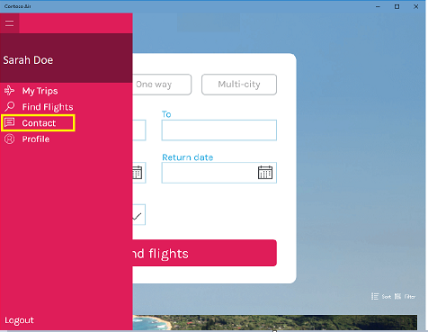
1. Click on **Customer service** option.
   
1. Click on **Skype** option.
   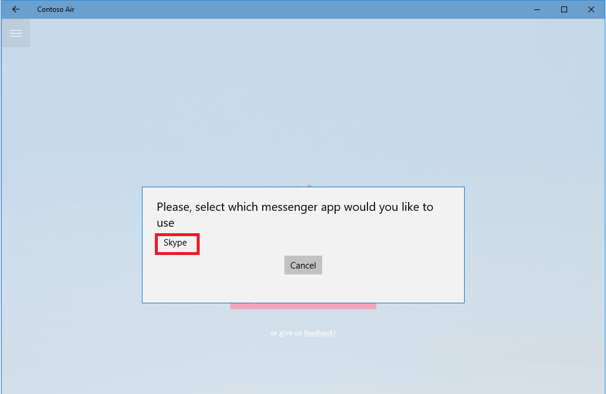
1. It will redirect to the app selection for **Skype bot**, select option and enter **Email Id** and **Password** and click on **Sign in** button.
   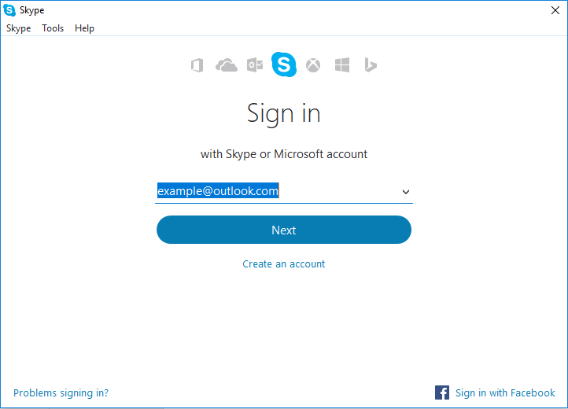
   
1. Click on **Add to Contacts** button to add the **Skype bot** into **Contacts** list.
   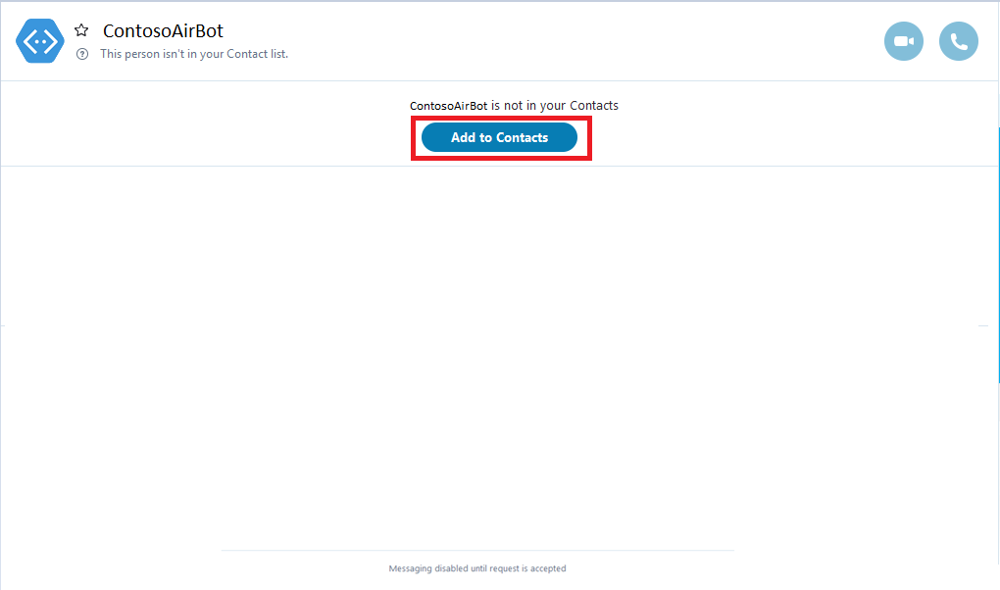
1. Here you will see that there are 4 option available in the **Bot**.
   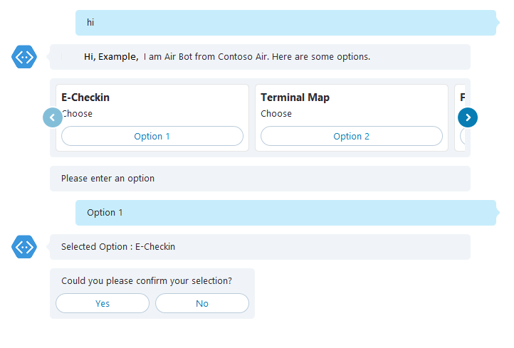
   >**NOTE:**
   > Enter PNR code as contoso456.
   > _Yeah, you have successfully Built Intelligent Bot using Azure Bot Service and Cosmos DB._