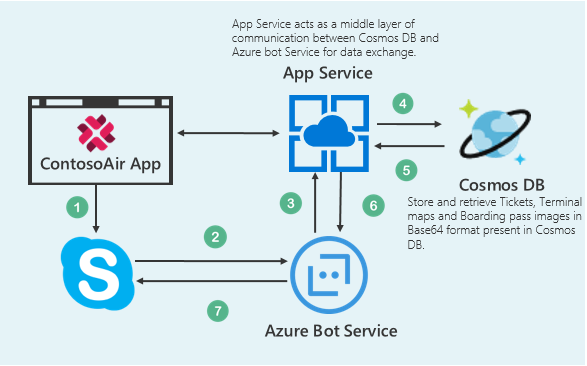

## User Story

Consider the user scenario, Kevin is driving towards the airport and due to some reasons, he would get late to catch up his flight. He wants immediate help regarding flight schedule, alternate flight options and E check-in to get the boarding pass. He also needs airport terminal map, so that he can save his time to find out the route of boarding gate. 

Using **ContosoAir** application you will explore about **Azure Bot Service** and **Cosmos DB** to get flight assistance. Azure Bot Service creates an intelligent bot to interact with users naturally wherever they are.

## Components Used in This Scenario

 

- **Azure Bot Service** provides an integrated environment that is purpose-built for bot development, enabling you to build, connect, test, deploy, and manage intelligent bots, all from one place. You can write your bot in C# or Node.js directly in the browser using the Azure editor.[(](https://docs.microsoft.com/en-us/bot-framework/azure-bot-service-quickstart) [Azure Bot Service)](https://docs.microsoft.com/en-us/bot-framework/azure-bot-service-quickstart)
- **Azure Cosmos DB** is Microsoft's globally distributed, multi-model database. With the click of a button, Azure Cosmos DB enables you to elastically and independently scale throughput and storage across any number of Azure's geographic regions. It offers throughput, latency, availability, and consistency guarantees with comprehensive  [service level agreements](https://aka.ms/acdbsla) (SLAs), something no other database service can offer.([Azure Cosmos DB](https://docs.microsoft.com/en-us/azure/cosmos-db/))

## What you will learn from this lab

- Creating a Bot using **Azure Bot Service**.
- Create a collection and insert data in **Cosmos DB** using **Data Migration Tool.**
- Playing around code in **Visual Studio 2017** IDE.

>_**Ready? Let's get started!**_