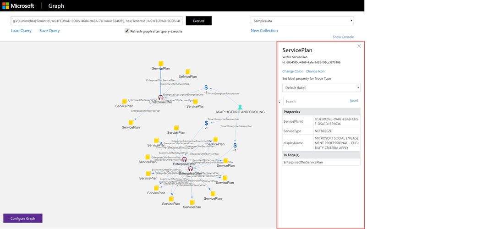
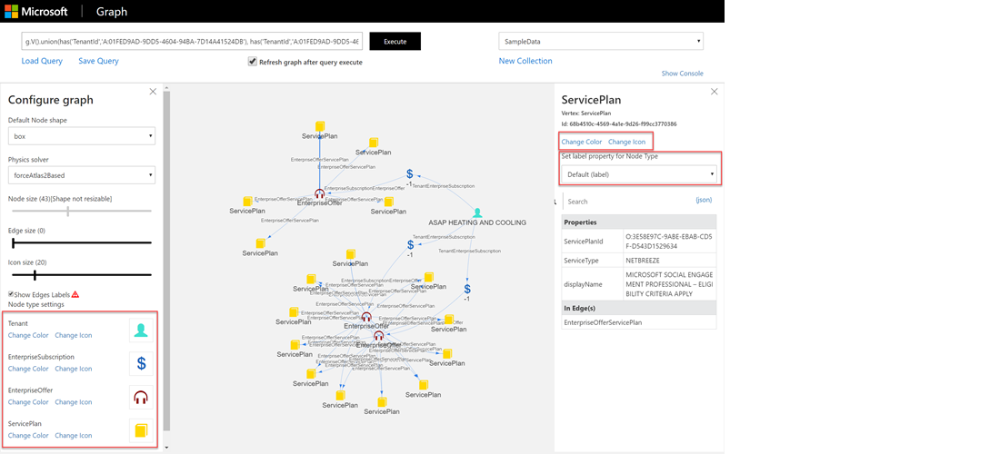
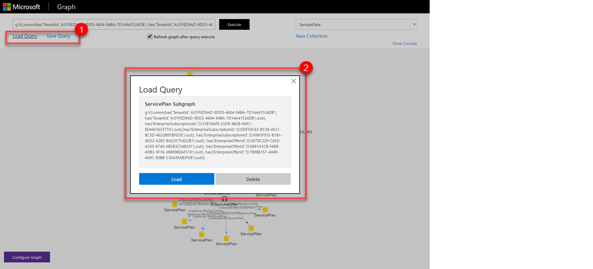
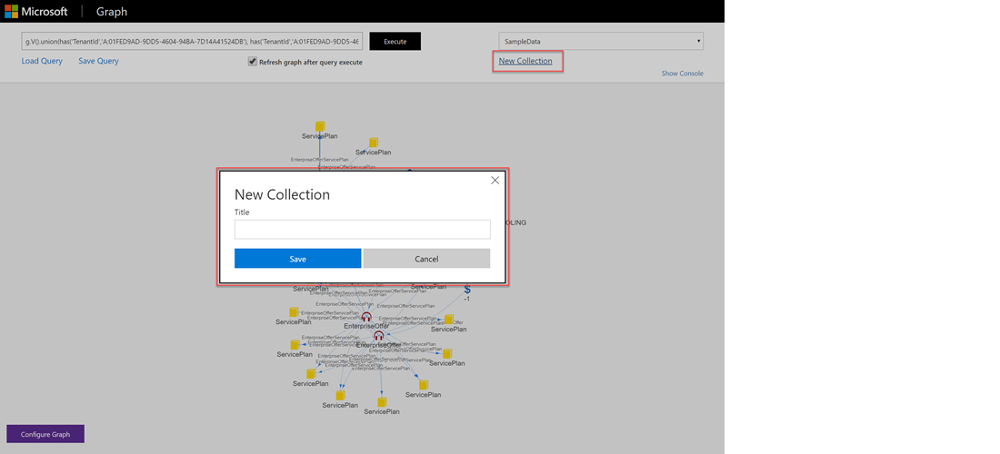

# A Guided Tour of Azure Cosmos DB Gremlin API#
This sample application shows how to interact with Azure CosmosDB Gremlin (Graph) API and visualize the results.  The query language used is [Gremlin](https://en.wikipedia.org/wiki/Gremlin_(programming_language)) which is a [graph](https://en.wikipedia.org/wiki/Graph_(discrete_mathematics)) traversal language that uses vertices and edges as primary constructs.  This sample shows how to put your data into Cosmos DB through a console application using the Azure DocumentDB graph library as well as querying the data using the Gremlin language specification from a user interface.

## Prerequisites ##
* Visual Studio 2015 Update 3 or later.
* Node.js which can be downloaded here: <a href="https://nodejs.org/dist/v6.10.2/node-v6.10.2-x64.msi">https://nodejs.org/dist/v6.10.2/node-v6.10.2-x64.msi</a>


## Contents of the Sample ##
The Sample has two projects:
* A console application for uploading some sample data into Cosmos DB.
* An ASP.NET MVC front-end application that shows how to query the graph using the Gremlin language.

## How to run the sample ##
### Uploading the sample data ###
Uploading the sample data is done via the console application project included in this quick start. The sample app is already configured to point to your collection you created as part of the quick start experience in the portal.
2. Open the <font color='lightblue'>/tools/GraphDataUploaderSample.sln</font> solution in Visual Studio.
3. Verify your collection information in the App.Config. if you downloaded this sample from Azure portal quickstart blade, this is all already pre-configured for you. If you downloaded the sample from the github, you need to create the collection yourself and set these settings.

| AppSetting             |     Value                                                                                                                           |
|:-----------------------|:------------------------------------------------------------------------------------------------------------------------------------|
| endpoint               | Cosmos DB service endpoint (https://{your instance}.documents.azure.com)                           |
| authKey                | Cosmos DB authentication key 
| database               | Cosmos DB database name                                                                     |
| collection             | Cosmos DB collection name                                                                 |

3. Run the console app.  The documents should be imported into your Cosmos DB.  You can use the document explorer to view the JSON content.
This process can take some time, so be patient.  When it is finished, you'll see a message letting you know.
NOTE: The console app attempts to synchronize the settings you specify in App.Config with the GraphExplorer's appsettings.json project.
If this process fails for any reason, you will see a message, but don't worry.  You can always edit the appsettings.json file manually.


### Running the GraphExplorer front-end application ###
1. Open the <font color='lightblue'>/web/GraphExplorer.sln</font> solution in Visual Studio.
2. Verify your settings in the appsettings.json. if you downloaded this sample from Azure portal quickstart blade, this is all already pre-configured for you. if you downloaded the sample from the github repository, this step is also likely unnecessay. If the console uploader app ran successfully, the appsettings.json file should already
be updated for you.  But you can double-check just to be sure.  If anything doesn't look right, go ahead and edit it now, by
entering your Cosmos DB connection parameters for the following values in appsettings.json:

| AppSetting              |     Value                                                                                                                          |
|:------------------------|:-----------------------------------------------------------------------------------------------------------------------------------|
| endpoint                | Cosmos DB service endpoint (https://{your instance}.documents.azure.com)                          |
| authKey                 | Cosmos DB authentication key generated by Azure (this is marked as the Primary Key and must be Read-Write) |
| database                | Cosmos DB database name                                                                    |

3. Run the application (F5).

### Enabling Azure Active Directory Authentication (optional)
1. Register GraphExplorer with your Active Directory tenant (see <a href="https://docs.microsoft.com/en-us/azure/active-directory/active-directory-app-registration"> https://docs.microsoft.com/en-us/azure/active-directory/active-directory-app-registration</a>) and find the **Application ID**.
2. Run the following Cmdlet in Powershell and login to get your **Tenant ID**:
```
Login-AzureRmAccount
```
3. In the file **boot.ts** change **alwaysRequireLogin** to *true* and replace {TenantID} in both URLs with your Tenant ID.
4. Edit **Web.config** and set the value of "AuthenticationEnabled" to *true*.
5. Additionally replace the value of **ida:Tenant** with your Tenant ID and the value of **ida:Audience** with your Application ID.

## Basic Description of the Application ##
The web application allows you to run Gremlin queries against the sample data as well as data you create yourself.  It also allows you to assign icons and colors to vertices and edges and the default label for them to beautify the visualization of the graph.  Other features on the web application are:
* **Saving and Loading Gremlin queries**.  (Note: If you upload the sample data, a set of sample queries will be available for you.)
* **A console area for showing the output of the Gremlin query**.  Not all results are in a graph structure.  Results could be a string, or a collection of strings.  These will show on the console area.  If the query resulted in an error, the error messages will also be shown on the console area.
* **Global settings for the graph visualization**.  For example, edge thickness, icon sizes, graph stabilization parameters.
* **Creating a new collection**.  You can create a new collection or change between collections in the same Cosmos DB.  This allows you to create a graph from scratch.  Node creation and updates right now uses the Gremlin syntax and is done via the command input box.


*Running a Query*
<br />
    

    1. Enter your gremlin query and execute.
    2. If the output is a graph, it will show on the network graph surface.
    3. All output are shown on the console area.  This is especially important if your query returns a string or an array of strings instead of a graph.

&nbsp;
    

    Clicking on any of the nodes or edges will bring up the property pane.  There is a search box to filter properties based on a substring search of the property name.

*The Console Area*
<br />
    

    The console shows any output from the gremlin query including errors
    1. There are 2 views on the console, standard summarizes what was returned.  The JSON view shows the raw JSON output.
    2. There are some basic controls for the console, including clearing the console content and sizing the console window (expand, collapse, default).


*Changing the Icons and Colors of Vertices and Edges*
<br />
    

    1. The icons and colors can be changed globally by either clicking on the Configure Graph button at the bottom left of the window to show all the current node types loaded on the graph and selecting an icon or color for them or
    2. You can click on a node and the properties panel also has the Change Color and Change Icon functionality.  Additionally, we can also change the label shown on the graph for the node type.

    Note: The application saves your choices so the next time your query loads data with the same node types, they will show the icons and colors you have previously selected.

*Saving and Loading Queries*
<br />
    

    1. Use the Load Query and Save Query links to open the Save and Load Query dialogs.

*Starting a New Collection*
<br />
    
    
    1. Click on the New Collection link to create a new collection.  
    2. Give your collection a name.  Note: this creates a new collection on your Cosmos DB and you will be charged for it if you are using Azure instead of the Cosmos DB emulator.
    3. You can switch between collections on the Collection drop down.

## Open Source libraries used in the sample ##
This quick start application used some open source libraries (see also ThirdPartyNotices.txt for licenses):
* <a href="http://aurelia.io/" target="_blank">Aurelia</a> - Aurelia is a JavaScript client framework for mobile, desktop and web leveraging simple conventions and empowering creativity.  Used for building the single page application on the ASP.NET web project.
* <a href="http://visjs.org/" target="_blank">vis.js</a> - A dynamic, browser based visualization library.  Used for generating the network graph on the web project.
* <a href="https://github.com/mohsen1/json-formatter-js" target="_blank">json-formatter-js</a> - Simple library to render/format a JS obj to an HTML view. 